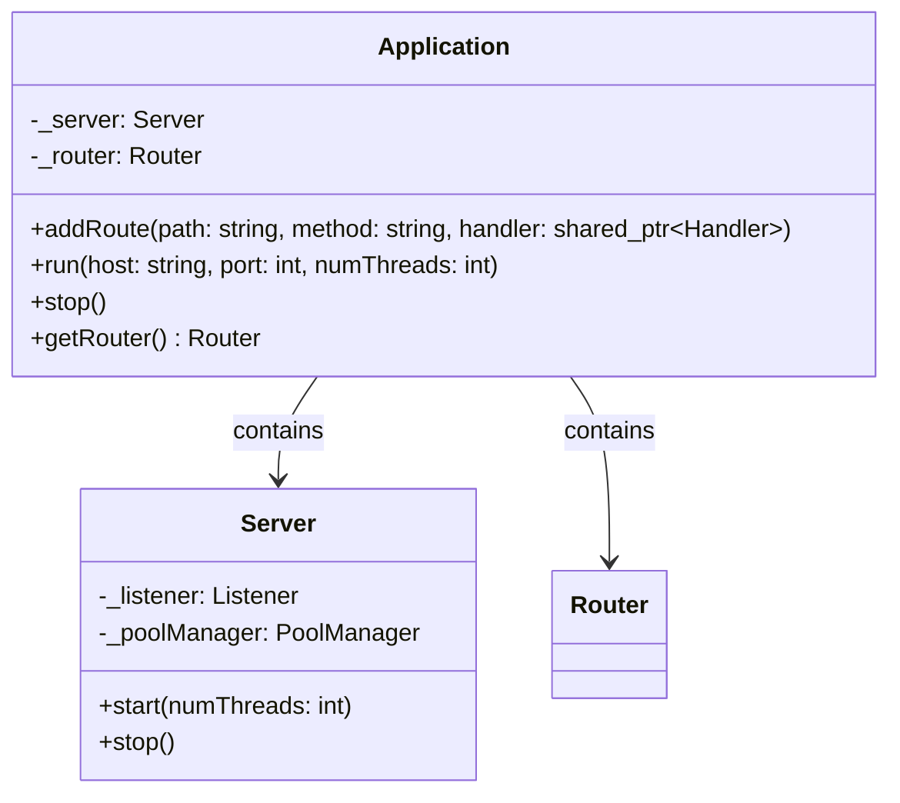
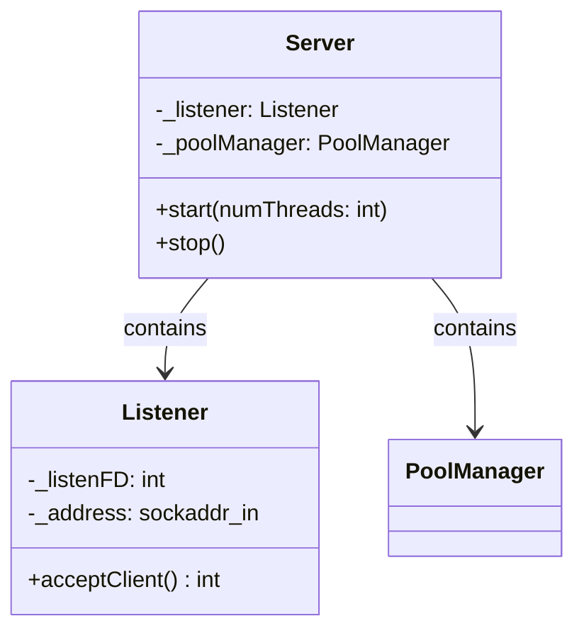
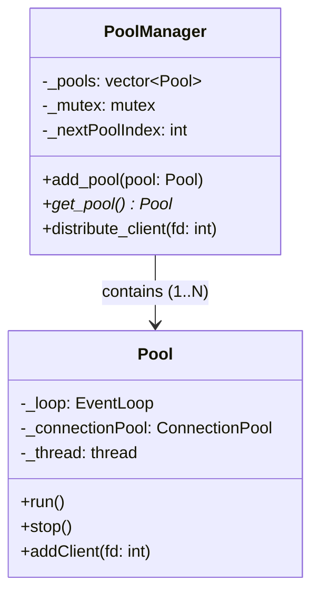
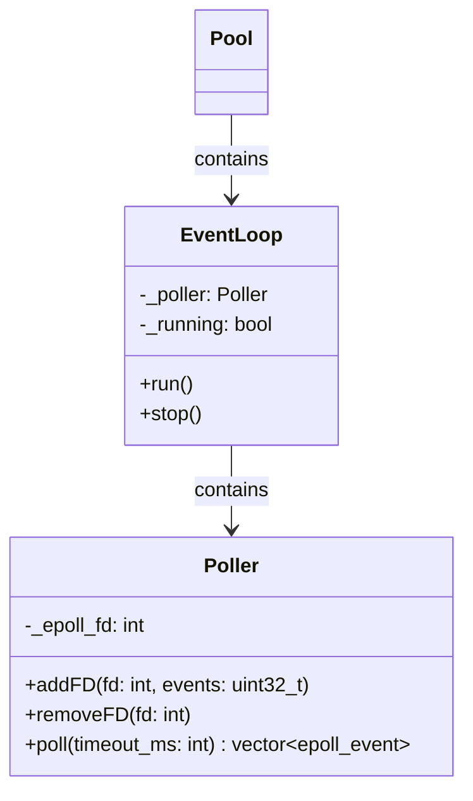
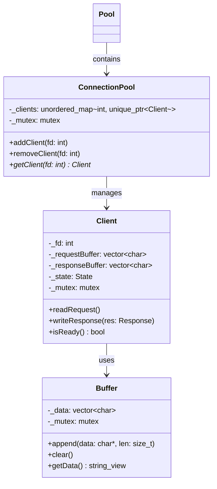
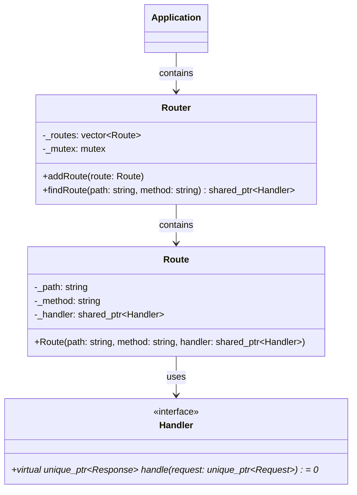
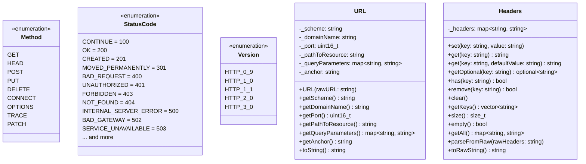
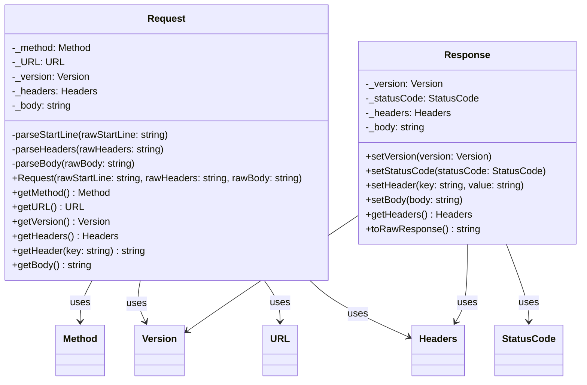
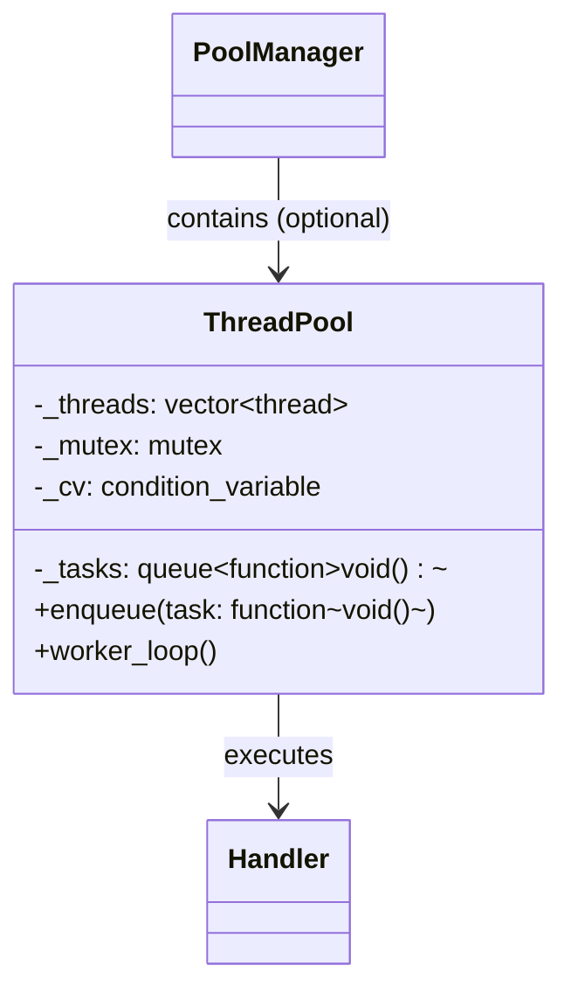
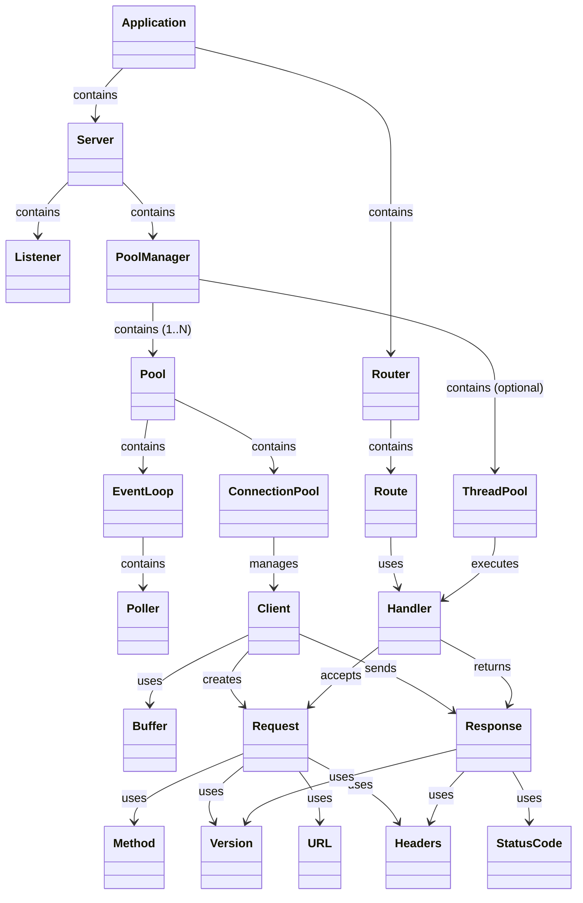

# Architecture

This document splits the architecture into focused views so each part can be explained independently, then brings them back together with a compact overview.

---

## Application (Top-Level)

The `Application` class is the entry point and orchestrates the entire framework.

**Purpose:**

- **Application**: The top-level class that owns the `Server` and `Router`. It initializes the server, manages routes, and starts/stops the framework.
- **Server**: Manages the listener, pool manager, and I/O threads.

---

## Server and Listener

The server and listener handle connection acceptance and I/O orchestration.

**Purpose:**

- **Server**: Orchestrates the listener and pool manager.
- **Listener**: Binds to a port and accepts new client connections.

---

## Pool Management

Distributes and manages client connections across multiple I/O threads.

**Purpose:**

- **PoolManager**: Coordinates multiple `Pool` instances, distributing new client connections (e.g., round-robin).
- **Pool**: Encapsulates an `EventLoop`, `ConnectionPool`, and a thread. Each pool runs independently, handling I/O for its assigned clients.

---

## I/O and Event Loop

Monitors and processes I/O events for clients.

**Purpose:**

- **EventLoop**: Runs in each pool’s thread, processing I/O events.
- **Poller**: Uses `poll` to monitor sockets for read/write events.

---

## Connection Management

Manages active client connections and their data buffers.

**Purpose:**

- **ConnectionPool**: Thread-safe container for active clients.
- **Client**: Represents a single client connection, with buffers for request/response data.
- **Buffer**: Thread-safe storage for raw request/response bytes.

---

## Routing Layer

Wires incoming requests to business logic.

**Purpose:**

- **Router**: Stores routes and resolves handlers for incoming requests.
- **Route**: Binds a path, method, and handler.
- **Handler**: Interface for request processing.

---

## HTTP Primitives

Core HTTP types used across the system.

**Purpose:**

- **Method/StatusCode/Version/URL/Headers**: Core HTTP types and utilities.

---

## HTTP Messages

Models HTTP requests and responses.

**Purpose:**

- **Request/Response**: Encapsulate HTTP messages with headers, body, and metadata.

---

## Thread Pool (Optional)

Offloads CPU-bound handler execution.

**Purpose:**

- **ThreadPool**: Executes handlers in worker threads to avoid blocking I/O threads.

---

## End-to-End Overview

This compact view shows how everything connects during a typical request lifecycle.

**Workflow:**

1. **Application** starts the **Server** and **Router**.
2. **Listener** accepts a connection → **PoolManager** distributes it to a **Pool**.
3. **Pool**’s **EventLoop** monitors the client socket.
4. **Client** reads the request → **Router** resolves the **Handler**.
5. **Handler** processes the request (optionally in **ThreadPool**) → **Client** writes the response.
