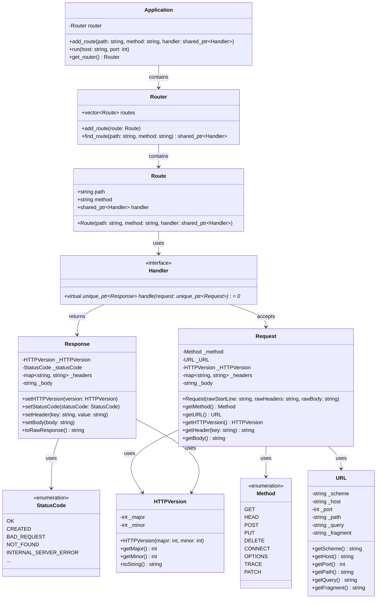

# Architecture

```mermaid
classDiagram
    %% Main Classes
    class Application {
        -Router router
        +add_route(path: string, method: string, handler: shared_ptr~Handler~)
        +run(host: string, port: int)
        +get_router() Router
    }

    class Router {
        +vector~Route~ routes
        +add_route(route: Route)
        +find_route(path: string, method: string) shared_ptr~Handler~
    }

    class Route {
        +string path
        +string method
        +shared_ptr~Handler~ handler
        +Route(path: string, method: string, handler: shared_ptr~Handler~)
    }

    class Handler {
        <<interface>>
        +virtual unique_ptr~Response~ handle(request: unique_ptr~Request~)* = 0
    }

    class Request {
        -Method _method
        -URL _URL
        -HTTPVersion _HTTPVersion
        -map~string, string~ _headers
        -string _body
        +Request(rawStartLine: string, rawHeaders: string, rawBody: string)
        +getMethod() Method
        +getURL() URL
        +getHTTPVersion() HTTPVersion
        +getHeader(key: string) string
        +getBody() string
    }

    class Response {
        -HTTPVersion _HTTPVersion
        -StatusCode _statusCode
        -map~string, string~ _headers
        -string _body
        +setHTTPVersion(version: HTTPVersion)
        +setStatusCode(statusCode: StatusCode)
        +setHeader(key: string, value: string)
        +setBody(body: string)
        +toRawResponse() string
    }

    class Method {
        <<enumeration>>
        GET
        HEAD
        POST
        PUT
        DELETE
        CONNECT
        OPTIONS
        TRACE
        PATCH
    }

    class StatusCode {
        <<enumeration>>
        OK
        CREATED
        BAD_REQUEST
        NOT_FOUND
        INTERNAL_SERVER_ERROR
        ...
    }

    class HTTPVersion {
        -int _major
        -int _minor
        +HTTPVersion(major: int, minor: int)
        +getMajor() int
        +getMinor() int
        +toString() string
    }

    class URL {
        -string _scheme
        -string _host
        -int _port
        -string _path
        -string _query
        -string _fragment
        +getScheme() string
        +getHost() string
        +getPort() int
        +getPath() string
        +getQuery() string
        +getFragment() string
    }

    %% Relationships
    Application --> Router : contains
    Router --> Route : contains
    Route --> Handler : uses
    Handler --> Response : returns
    Handler --> Request : accepts
    Request --> Method : uses
    Request --> HTTPVersion : uses
    Request --> URL : uses
    Response --> StatusCode : uses
    Response --> HTTPVersion : uses
```
