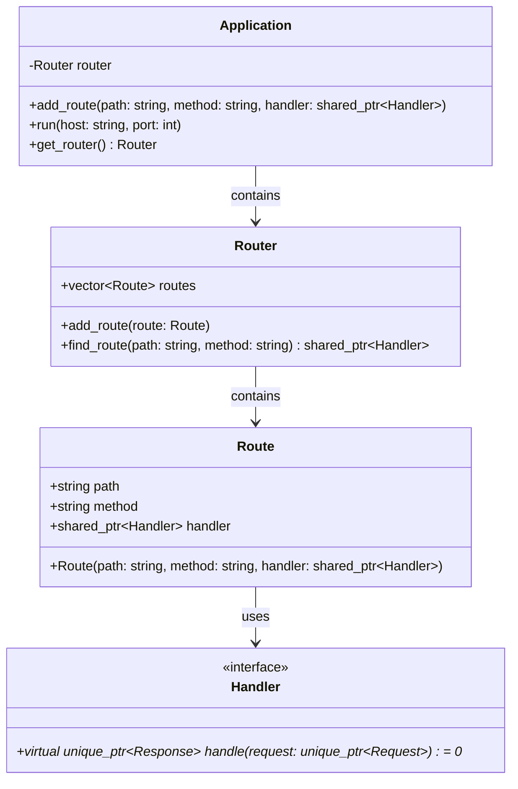
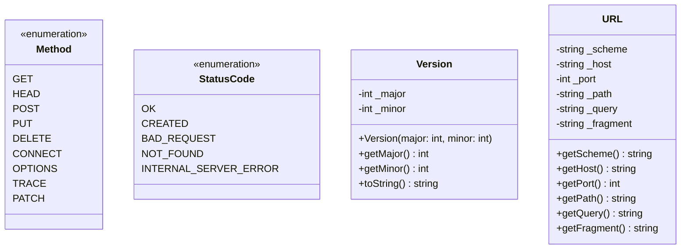
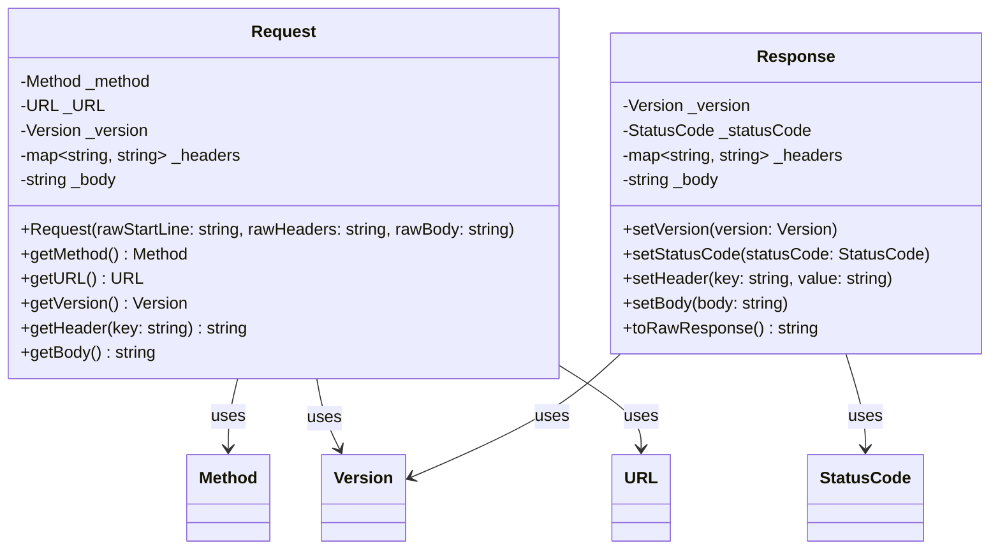
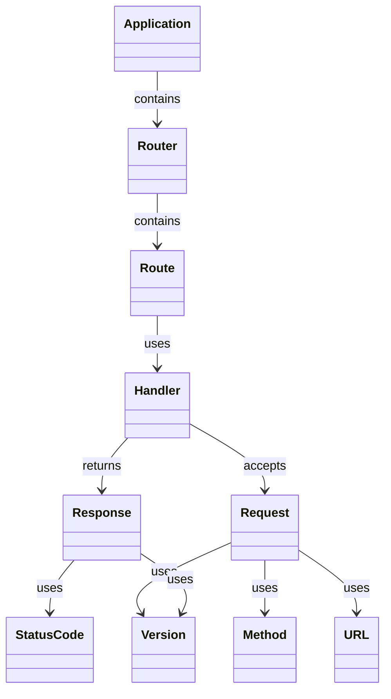

# Architecture

This document splits the architecture into focused views so each part can be explained independently, then brings them back together with a compact overview.

## Routing layer

The routing layer wires incoming requests to business logic:

- `Application` owns a `Router` and starts the server.
- `Router` stores `Route` entries and resolves a handler for a path + method.
- `Route` binds an HTTP method and path to a `Handler`.
- `Handler` is an interface: handle a `Request` and produce a `Response`.

## HTTP primitives

Core HTTP types used across the system:

- `Method` and `StatusCode` are enums.
- `Version` captures the HTTP major/minor version.
- `URL` stores parsed components of a request target.

## HTTP messages

`Request` and `Response` represent the HTTP message model:

- `Request` holds method, URL, version, headers, and body.
- `Response` holds version, status, headers, and body.
- Both reference the primitives above.

## End‑to‑end overview

This compact view shows how everything connects during a typical request lifecycle.

