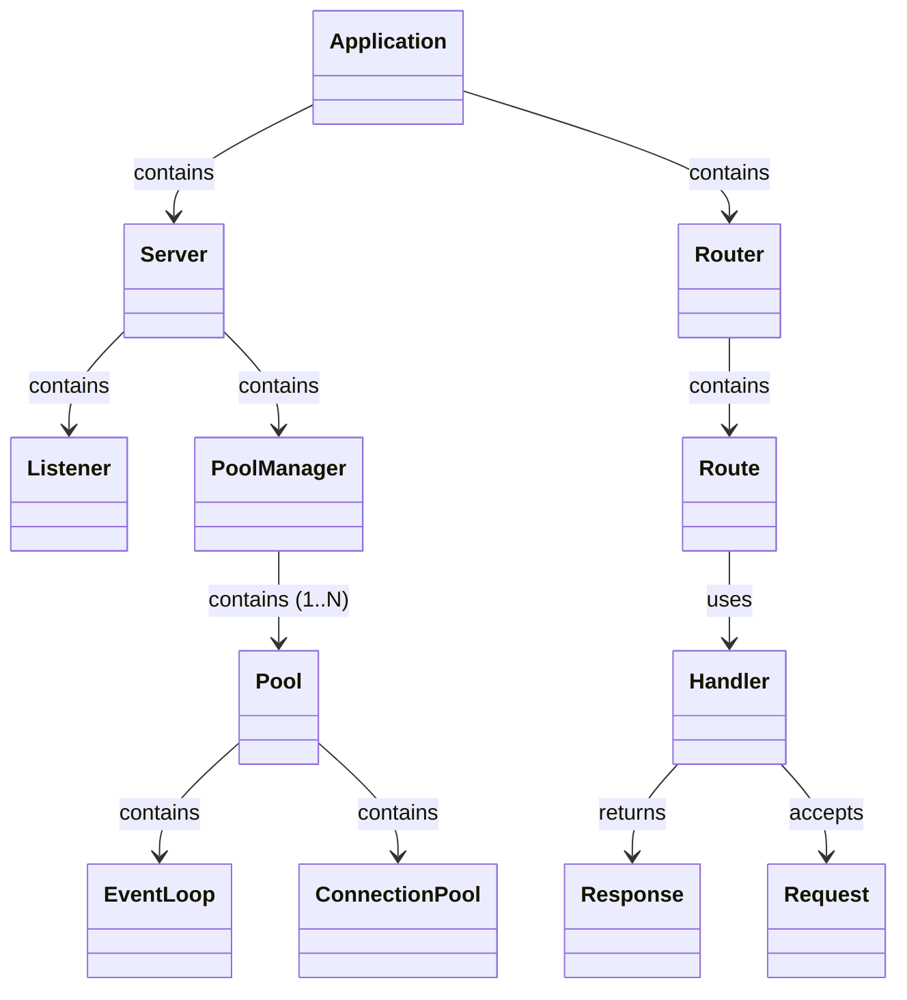

# FION — Minimal, Modern HTTP Server Library for C++20

FION is a lightweight, dependency-free HTTP server framework for C++20. It’s designed for simplicity, performance, and easy embedding in microservices, containers, or embedded systems. FION uses POSIX sockets and poll(2) for efficient I/O multiplexing and supports advanced routing features out of the box.

## Project Goals

- **Minimal**: Only STL and libc required. No external dependencies.
- **Modern**: C++20 features, clean API, and extensible design.
- **Flexible Routing**: Path parameters, wildcards, regex, grouping, middleware, and RESTful helpers.
- **Efficient I/O**: Single-threaded event loop (with optional thread pool for CPU-bound tasks).
- **Portable**: Runs on Linux/macOS and other POSIX-like systems.

## Architecture Overview

FION is organized into modular components:

- **Application**: Top-level orchestrator. Owns the server and router.
- **Server**: Manages listeners, pools, and I/O threads.
- **Router**: Stores routes, resolves handlers, and supports advanced matching.
- **PoolManager/Pool**: Distributes connections and runs event loops.
- **Request/Response**: Encapsulate HTTP messages, headers, and body.

See [`ARCHITECTURE.md`](ARCHITECTURE.md) for full diagrams and details.

### Simplified Architecture Diagram



## Routing Features

- **Static and Parameterized Routes**: `/users/:id`, `/files/*`, `/search/(.*)`
- **Regex and Wildcard Matching**: Register routes with regex or wildcards for flexible matching.
- **Route Grouping**: Organize routes under a common prefix and apply group-level middleware.
- **Middleware Support**: Functions that run before handlers (logging, auth, etc.).
- **RESTful Resource Helpers**: Register standard REST endpoints for resources with a single call.

## Request Lifecycle

1. **Application** starts the **Server** and **Router**.
2. **Listener** accepts connections, **PoolManager** distributes to **Pool**.
3. **Pool**’s **EventLoop** monitors sockets and reads requests.
4. **Router** matches the request to a **Handler** (extracts parameters, runs middleware).
5. **Handler** processes the request and returns a **Response**.
6. **Client** writes the response back to the socket.

## Example Usage

```cpp
#include "fion/Application.hpp"

int main() {
  fion::Application app;

  auto hello_handler = std::make_shared<HelloHandler>();
  auto log_middleware = [](std::unique_ptr<fion::http::Request>& req) {
    std::cout << "[Middleware] " << req->getURL().getPathToResource() << std::endl;
  };

  // Static route
  app.addRoute("/", "GET", hello_handler, {log_middleware});

  // Parameterized route
  app.addRoute("/users/:id", "GET", hello_handler, {log_middleware});

  // Regex route
  app.addRoute("/search/(.*)", "GET", hello_handler, {log_middleware}, true, {"query"});

  // Grouped routes
  std::vector<fion::Route> apiRoutes = {
    fion::Route("/status", "GET", hello_handler),
    fion::Route("/info", "GET", hello_handler)
  };
  app.addGroup("/api", apiRoutes, {log_middleware});

  // RESTful resource
  app.addResource("items", hello_handler, {log_middleware});

  app.run("0.0.0.0", 8080);
  return 0;
}
```

## I/O Model

- Single-threaded event loop using poll(2).
- Non-blocking sockets for efficient handling of many connections.
- Optional thread pool for CPU-bound handler execution.

## Building

- Requires C++20 compiler (g++/clang++)
- POSIX environment (Linux/macOS)

Example:

```bash
g++ -std=c++20 -O2 -Wall -o example_server src/main.cpp
```

## Testing

```bash
curl -v http://localhost:8080/
curl -v http://localhost:8080/users/42
```

## Contributing

- Fork, create a feature branch, open a PR with tests and a short description.
- Keep changes small and consistent with the minimal, dependency-free goal.

## License

MIT (see LICENSE)

## More Information

See [`ARCHITECTURE.md`](ARCHITECTURE.md) for full diagrams, class details, and request lifecycle.

- Server(port)
  - get(path, handler), post(path, handler), put(...), del(...)
  - use(middleware)
  - listen() — runs the poll-based event loop
- Request
  - method, path, query, headers, params, body, remote_addr
- Response
  - set_status(code), set_header(k,v), send(body), send_file(path)

Router and parameters

- Routes support static and parameter segments (e.g. /items/:id).
- Query parameters are parsed into Request::query.

Middleware

- Middleware has signature (Request&, Response&, next) and may call next() to continue the chain or terminate the response early.

I/O model

- Single-threaded event loop using poll(2).
- Non-blocking sockets and efficient handling of many simultaneous connections without per-connection threads.

Testing with curl

```bash
curl -v http://localhost:8080/hello
```

Notes and best practices

- Designed for small services; for CPU-bound workloads, consider offloading work to worker threads or processes.
- Ensure long-running handlers do not block the event loop.

Contributing

- Fork, create a feature branch, open a PR with tests and a short description.
- Keep changes small and consistent with the minimal, dependency-free goal.

License

- MIT (or specify your preferred license in the repository)

Contact

- Issues and PRs welcome on the repository.

For full reference and more examples, see the examples/ directory in the repo.
